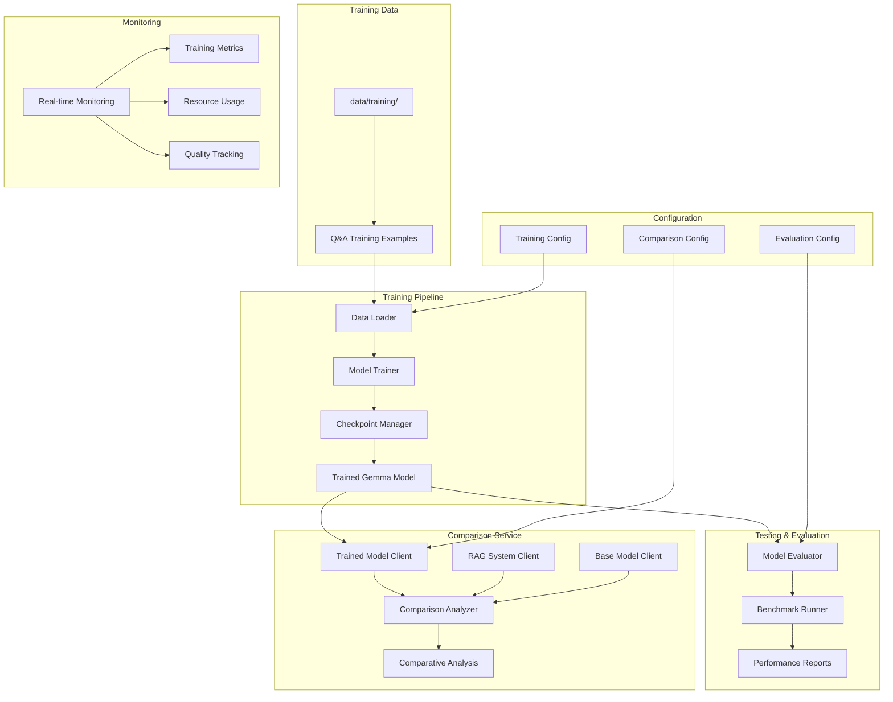
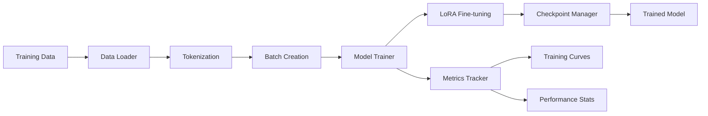
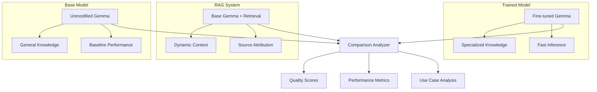
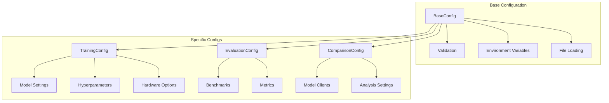
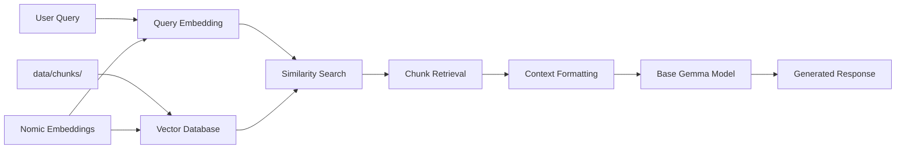

# Model Training Module

A comprehensive, configurable pipeline for training, testing, and comparing LLM models specifically designed for coding tasks using Gemma architecture.

## 🏗️ Architecture Overview



## 📁 Directory Structure

```
model_training/
├── training_pipeline/              # Core model training infrastructure
│   ├── main.py                    # Training orchestrator
│   ├── components/
│   │   ├── data_loader.py         # Training data loading and preprocessing
│   │   ├── model_trainer.py       # Gemma fine-tuning with LoRA/QLoRA
│   │   └── checkpoint_manager.py  # Model checkpointing and management
│   ├── models/
│   │   └── config.py              # Training configuration classes
│   └── utils/
│       └── metrics.py             # Training metrics and visualization
├── testing_service/               # Model evaluation and testing
│   ├── main.py                   # Testing orchestrator
│   ├── components/
│   │   ├── model_evaluator.py    # Core evaluation infrastructure
│   │   └── benchmark_runner.py   # Performance and load testing
│   ├── models/                   # Testing data structures
│   └── utils/                    # Testing utilities
├── comparison_service/            # Multi-model comparison analysis
│   ├── main.py                   # Comparison orchestrator
│   ├── components/
│   │   ├── trained_model_client.py  # Fine-tuned model interface
│   │   ├── rag_system_client.py     # RAG with base model + chunks
│   │   ├── base_model_client.py     # Pure base Gemma model
│   │   └── comparison_analyzer.py   # Comparative analysis engine
│   ├── models/                      # Comparison data structures
│   └── utils/                       # Comparison utilities
├── monitoring_service/              # Real-time monitoring and alerting
│   ├── main.py                     # Monitoring orchestrator
│   ├── components/                 # Monitoring components
│   ├── models/                     # Monitoring data structures
│   └── utils/                      # Monitoring utilities
└── config/                         # Centralized configuration management
    ├── base_config.py              # Base configuration classes
    ├── training_config.py          # Training-specific settings
    ├── evaluation_config.py        # Evaluation and testing settings
    └── comparison_config.py        # Comparison analysis settings
```

## 🚀 Key Components

### Training Pipeline

**Purpose**: Fine-tune Gemma models on coding-specific Q&A data

**Key Features**:
- **Efficient Training**: Unsloth integration for fast Gemma fine-tuning
- **Parameter-Efficient**: LoRA/QLoRA adapters for memory-efficient training
- **Robust Checkpointing**: Automatic saves with best model selection
- **Comprehensive Metrics**: Training progress, loss curves, and quality metrics

**Training Process**:


### Testing Service

**Purpose**: Comprehensive evaluation of trained models

**Evaluation Capabilities**:
- **Quality Assessment**: BLEU, ROUGE, code correctness scoring
- **Performance Benchmarking**: Latency, throughput, resource usage
- **Robustness Testing**: Edge cases, stress testing, consistency checks
- **Regression Testing**: Compare against baseline and previous versions

### Comparison Service

**Purpose**: Side-by-side comparison of three different approaches

**Comparison Targets**:



**Analysis Dimensions**:
- **Accuracy**: Factual correctness and technical accuracy
- **Performance**: Response time, resource usage, throughput
- **Quality**: Response clarity, completeness, usefulness
- **Consistency**: Reliability across similar queries
- **Cost-Effectiveness**: Training cost vs performance gains

### Monitoring Service

**Purpose**: Real-time tracking of training and deployment health

**Monitoring Features**:
- **Training Progress**: Live loss curves, ETA calculation, quality metrics
- **Resource Utilization**: GPU/CPU usage, memory consumption, thermal monitoring
- **Quality Tracking**: Response quality drift, performance degradation detection
- **Alerting**: Critical issue notifications, threshold-based alerts

## ⚙️ Configuration System

### Highly Configurable Architecture



**Configuration Features**:
- **Environment-Specific**: Dev, staging, production configurations
- **Validation**: Type checking, range validation, dependency verification
- **Inheritance**: Hierarchical configuration with overrides
- **File Support**: JSON/YAML configuration loading
- **Runtime Updates**: Dynamic configuration changes

## 🔧 Technical Implementation

### Training Technology Stack

**Core Framework**:
- **Unsloth**: Efficient Gemma training with 2x speedup
- **LoRA/QLoRA**: Parameter-efficient fine-tuning
- **Flash Attention 2**: Memory-efficient attention computation
- **Mixed Precision**: fp16/bf16 for faster training

**Optimization Features**:
- **Gradient Checkpointing**: Reduce memory usage
- **Gradient Accumulation**: Simulate larger batch sizes
- **Dynamic Loss Scaling**: Stable mixed precision training
- **Learning Rate Scheduling**: Optimal convergence

### RAG System Architecture

**Vector Database Integration**:


**Features**:
- **Consistent Embeddings**: Same model as chunk creation
- **Efficient Search**: FAISS/Chroma for fast similarity search
- **Context Management**: Intelligent context length handling
- **Source Attribution**: Track and cite source documents

## 📊 Usage Examples

### Training a Model

```python
# Training pipeline execution
from model_training.training_pipeline.main import main as train_model
from model_training.config.training_config import TrainingConfig

# Configure training
config = TrainingConfig.create_default()
config.model_name = "gemma-2b"
config.learning_rate = 2e-4
config.batch_size = 4
config.epochs = 3

# Execute training
train_model(config)
```

### Running Comparisons

```python
# Comparison service execution
from model_training.comparison_service.main import main as run_comparison
from model_training.config.comparison_config import ComparisonConfig

# Configure comparison
config = ComparisonConfig.create_default()
config.test_queries = ["How to implement LoRA?", "Explain Gemma architecture"]

# Execute comparison
results = run_comparison(config)
```

### Model Evaluation

```python
# Testing service execution
from model_training.testing_service.main import main as evaluate_model
from model_training.config.evaluation_config import EvaluationConfig

# Configure evaluation
config = EvaluationConfig.create_default()
config.model_path = "checkpoints/best_model"
config.benchmark_suite = ["code_generation", "qa_accuracy"]

# Execute evaluation
metrics = evaluate_model(config)
```

## 🎯 Expected Workflow

1. **Train Model**: Use training pipeline to fine-tune Gemma on coding data
2. **Evaluate Performance**: Run comprehensive testing suite
3. **Compare Approaches**: Analyze trained model vs RAG vs base model
4. **Monitor Deployment**: Track model performance in production
5. **Iterate**: Use insights to improve training and configuration

## 📈 Success Metrics

**Training Success**:
- ✅ Converged training loss
- ✅ Improved validation metrics
- ✅ Successful checkpoint creation
- ✅ Model export completion

**Evaluation Success**:
- ✅ Comprehensive benchmark results
- ✅ Performance metric collection
- ✅ Quality assessment completion
- ✅ Comparison analysis generation

**Comparison Insights**:
- ✅ Clear performance differentiation
- ✅ Use case recommendations
- ✅ Cost-benefit analysis
- ✅ Deployment guidance

## 🚀 Getting Started

### Prerequisites

```bash
# Install training dependencies
uv add unsloth transformers torch peft
uv add datasets accelerate bitsandbytes
uv add wandb tensorboard  # Optional: experiment tracking

# Install evaluation dependencies  
uv add faiss-cpu chromadb  # Vector databases
uv add matplotlib seaborn  # Visualization
uv add scikit-learn pandas  # Analysis tools
```

### Environment Setup

```bash
# Required environment variables
export WANDB_PROJECT="coding-llm-training"  # Optional
export HF_TOKEN="your_huggingface_token"    # Optional
```

### Quick Start

```bash
# 1. Train the model
python model_training/training_pipeline/main.py

# 2. Evaluate the trained model
python model_training/testing_service/main.py

# 3. Run comparison analysis
python model_training/comparison_service/main.py

# 4. Monitor training (separate terminal)
python model_training/monitoring_service/main.py
```

This scaffold provides a complete, production-ready framework for training and evaluating coding LLMs with comprehensive comparison capabilities.